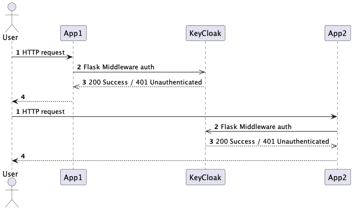
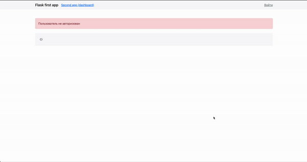

# Flask's app, KeyCloak, NGINX, Docker compose
2 одностраничых Flask сервиса в Docker контейнерах имеют SSO авторизацию. Данные пользователя могут быть безопасно переданы между сервисами.   

### Структура проекта

- `build` Директория содержит в себе основные сервисы с необходимыми для инициализации файлами
    - `keycloak` latest. Реализует SSO. Дирректория 
    - `import` Содержит JSON файлы для импортирования при сборке контейнера 
    - `nginx` Сконфигурированный NGINX сервер реализующий Reverse Proxy сквозь все сервисы и предоставляющий доступ http://localhost
    - `postgresql` БД используется только для хранения KC данных
    - [ ] TODO разобраться с предварительным импортом пользователя test\
  
- `components` Директория для организации всех разрабатываемых компонентов приложения (subrepo)
  - `app1` / `core` одностраничное Flask приложение с template интерфейсом (светлая шапка)
  - `app2` / `dashboard` одностраничное Flask приложение с template интерфейсом (темная шапка)

- `docs` Директория для ведения документации по проекту, по типу UML диаграмм, HTTP запросов, Swagger

# Базовое представление реализации

# Демонстрация работы

# Запуск
Приложение полностью готово к демонстративному запуску.
`docker-compose up -d` соберет и запустит приложение в фоновом режиме.
### Доступ к службам
NGINX настроен на прослушивание 80 порта и доступ ко всем сервисам осуществляется через localhost. Все сервисы общаются внутри Docker сети.
- Фронтенд первого приложения (core) доступен по адресу http://localhost/ (`core service / port 5000`)
- Фронтенд второго приложения (dashboard) доступен по адресу http://localhost/dashboard/ (`dashbaord service / port 5001`)
- Админка KyeCloak доступна по адресу http://localhost/auth/ `admin:admin`

# Тестирование
Приложение `core` покрыто юнит и интеграционными тестами (взаимодействие с keycloak). Текуший уровень тестирования позволяет определить корректность взаимодействия сервисов. Также есть возможность организации CI процесса.
# Возможные ошибки
### ConnectError / ReadTimeout
Сервисы `core`/`dashboard` имеют зависимость от сервиса `keycloak`, который быстро запускает контейнер в статус alive, но фактически еще не готов к выполению. При этом фронтенд Flask сервисов уже готов к работе и при попытке авторизации воспроизводится текущая ошибка. Лечится коротким ожиданием пока сервис KeyCloak полностью инициализируется.
### 502 после регистрации пользователя
Фактически это признак успешной регистрации пользователя. KeyCloak производит попытку авторизации зарегистрированного пользователя и крашится процесс. Лечится переходом на http://localhost и авторизацией с данными зарегистрированного пользователя. 